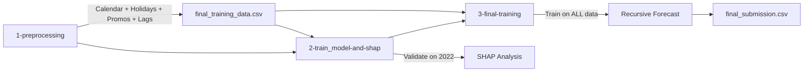

# 🔬 Pipeline Analysis & Improvement Recommendations

## Revenue & COGS Forecasting Model — Complete Code Review

> [!IMPORTANT]
> This document provides a thorough analysis of the three notebooks that form your forecasting pipeline:
> - [1-preprocessing.ipynb](file:///d:/projects/vin-datathon/model/1-preprocessing.ipynb) — Data loading, feature engineering, lag creation
> - [2-train_model-and-shap.ipynb](file:///d:/projects/vin-datathon/model/2-train_model-and-shap.ipynb) — Model training, validation, SHAP explainability
> - [3-final-training.ipynb](file:///d:/projects/vin-datathon/model/3-final-training.ipynb) — Full retrain + recursive test forecasting + submission

---

## Current Architecture Summary



**Current Validation Results (Notebook 2):**
| Target | MAE | RMSE | R² |
|--------|-----|------|-----|
| Revenue | 554,567.56 | 779,014.79 | 0.7834 |
| COGS | 478,729.46 | 679,480.47 | 0.7830 |

---

## 🔴 Critical Issue #1: Massive Untapped Data Sources

### Severity: 🔴 Critical — Likely the single biggest improvement opportunity

Your `original-data/` directory contains **13 datasets**, but the pipeline only uses **3** of them:

| Dataset | Used? | Shape | Potential Value |
|---------|-------|-------|-----------------|
| `sales.csv` | ✅ | 3,833 × 3 | Target variable (Revenue, COGS) |
| `promotions.csv` | ✅ | 50 × 10 | Active promo count only |
| `sample_submission.csv` | ✅ | 548 × 3 | Test date range |
| `orders.csv` | ❌ | 646,945 × 8 | **Order count, payment method, device type, order source** |
| `order_items.csv` | ❌ | 714,669 × 7 | **Quantity, unit price, discount amount, promo details** |
| `customers.csv` | ❌ | 121,930 × 7 | **Demographics: gender, age group, acquisition channel** |
| `web_traffic.csv` | ❌ | 3,652 × 7 | **Sessions, visitors, page views, bounce rate, traffic source** |
| `products.csv` | ❌ | 2,412 × 8 | **Categories, segments, prices, product-level COGS** |
| `returns.csv` | ❌ | 39,939 × 7 | **Return rates, refund amounts** |
| `inventory.csv` | ❌ | 60,247 × 17 | **Stock levels, stockout days, fill rate** |
| `payments.csv` | ❌ | 646,945 × 4 | **Payment values, installment info** |
| `shipments.csv` | ❌ | 566,067 × 4 | **Shipping dates, delivery times, fees** |
| `geography.csv` | ❌ | 39,948 × 4 | **Regional info for geographic features** |
| `reviews.csv` | ❌ | 113,551 × 7 | **Customer sentiment, ratings** |

> [!CAUTION]
> You are currently forecasting Revenue and COGS using **only calendar/holiday/promotion/lag features** while ignoring 10+ rich datasets that directly correlate with sales performance. This is by far the largest missed opportunity.

### Recommended Actions

**High-priority features to aggregate daily and merge into training data:**

1. **From `orders.csv`** — aggregate by date:
   - Daily order count
   - Payment method distribution (% credit card, % COD, etc.)
   - Device type distribution (% mobile, % desktop)
   - Order source distribution (% organic, % paid, % direct)

2. **From `web_traffic.csv`** — already daily-granularity, direct merge:
   - Total daily sessions, unique visitors, page views
   - Average bounce rate, session duration
   - Traffic source breakdown (organic, direct, social, paid, email, referral)

> [!WARNING]
> `web_traffic.csv` covers **2013-01-01 to 2022-12-31** — identical to training period. For test period (2023-2024), you'll need to either: (a) use lagged web traffic features, (b) forecast web traffic separately, or (c) use web traffic features only in training and rely on the model to generalize via other features.

3. **From `order_items.csv`** — aggregate by date:
   - Average basket size, average unit price
   - Total discount amount, discount rate
   - Category-level sales mix

4. **From `returns.csv`** — aggregate by date:
   - Daily return count, total refund amount
   - Return rate (returns / orders)

5. **From `products.csv` + `order_items.csv`** — category-level aggregations:
   - Revenue share by product category/segment
   - Average product price and COGS margin

---

## 🔴 Critical Issue #2: Promotion Features Are Severely Underutilized

### Severity: 🔴 Critical

**Current implementation** (Notebook 1, preprocessing):
```python
# Only counts how many promos are active — loses ALL other information
def count_active_promos(current_date):
    active = promotions[(promotions['start_date'] <= current_date) & 
                        (promotions['end_date'] >= current_date)]
    return len(active)

df['active_promos'] = df['Date'].apply(count_active_promos)
```

The `promotions.csv` has **10 columns** with rich information:
- `promo_type` — type of promotion
- `discount_value` — the actual discount amount
- `applicable_category` — which product category
- `promo_channel` — marketing channel
- `stackable_flag` — whether promos can stack
- `min_order_value` — minimum order threshold

### Recommended Actions

```python
# Extract much richer promotion features:
def extract_promo_features(current_date, promotions):
    active = promotions[
        (promotions['start_date'] <= current_date) & 
        (promotions['end_date'] >= current_date)
    ]
    return pd.Series({
        'active_promos': len(active),
        'total_discount_value': active['discount_value'].sum(),
        'max_discount_value': active['discount_value'].max() if len(active) > 0 else 0,
        'avg_discount_value': active['discount_value'].mean() if len(active) > 0 else 0,
        'stackable_promos': active['stackable_flag'].sum(),
        'n_promo_types': active['promo_type'].nunique(),
        'n_promo_channels': active['promo_channel'].nunique(),
        'n_categories_on_promo': active['applicable_category'].nunique(),
        'min_order_threshold': active['min_order_value'].min() if len(active) > 0 else 0,
    })
```

---

## 🟠 Major Issue #3: Missing Rolling/Window Features

### Severity: 🟠 Major

**Current lag features** (Notebook 1):
```python
lags = [1, 7, 14, 30, 365]
for lag in lags:
    df[f'rev_lag_{lag}'] = df['Revenue'].shift(lag)
    df[f'cogs_lag_{lag}'] = df['COGS'].shift(lag)
```

This creates **only point-in-time lags** — the model gets zero information about **trends, volatility, or moving patterns**.

### Recommended Actions

Add rolling statistics that capture temporal dynamics:

```python
# Rolling mean features (captures trend)
for window in [7, 14, 30, 90]:
    df[f'rev_rolling_mean_{window}'] = df['Revenue'].shift(1).rolling(window).mean()
    df[f'cogs_rolling_mean_{window}'] = df['COGS'].shift(1).rolling(window).mean()

# Rolling std (captures volatility)
for window in [7, 14, 30]:
    df[f'rev_rolling_std_{window}'] = df['Revenue'].shift(1).rolling(window).std()
    df[f'cogs_rolling_std_{window}'] = df['COGS'].shift(1).rolling(window).std()

# Rolling min/max (captures range)
for window in [7, 30]:
    df[f'rev_rolling_min_{window}'] = df['Revenue'].shift(1).rolling(window).min()
    df[f'rev_rolling_max_{window}'] = df['Revenue'].shift(1).rolling(window).max()

# Expanding mean (cumulative average up to this point)
df['rev_expanding_mean'] = df['Revenue'].shift(1).expanding().mean()

# Ratio features (captures relative position)
df['rev_ratio_to_7d_avg'] = df['rev_lag_1'] / df['rev_rolling_mean_7'].replace(0, np.nan)
df['rev_ratio_to_30d_avg'] = df['rev_lag_1'] / df['rev_rolling_mean_30'].replace(0, np.nan)

# Day-of-week average (same weekday historical average)
df['rev_dow_mean'] = df.groupby('day_of_week')['Revenue'].transform(
    lambda x: x.shift(1).expanding().mean()
)

# Month-over-month growth rate
df['rev_mom_growth'] = df['Revenue'].shift(1) / df['Revenue'].shift(31).replace(0, np.nan) - 1

# Year-over-year growth rate
df['rev_yoy_growth'] = df['Revenue'].shift(1) / df['Revenue'].shift(365).replace(0, np.nan) - 1
```

> [!TIP]
> Rolling features are extremely powerful for tree-based models because they encode **temporal context** that point-in-time lags cannot capture. The model can learn patterns like "revenue has been trending up for 30 days" or "volatility is unusually high this week."

> [!WARNING]
> Remember: during recursive forecasting (Notebook 3), these rolling features also need to be updated recursively, just like lags. Make sure to update them inside the prediction loop.

---

## 🟠 Major Issue #4: Training & Validation Methodology

### Severity: 🟠 Major

### 4a. Single-split validation is insufficient

**Current approach** (Notebook 2):
```python
# Train on data before 2022, validate on 2022
train_set = train_full[train_full['year'] < 2022].copy()
val_set = train_full[train_full['year'] == 2022].copy()
```

This gives you **one single evaluation** on one specific year. You have no idea if performance is consistent across different time periods.

**Recommendation**: Use **Time Series Cross-Validation** with expanding or sliding windows:

```python
from sklearn.model_selection import TimeSeriesSplit

# Or manual expanding window:
validation_years = [2019, 2020, 2021, 2022]
results = []
for val_year in validation_years:
    train_set = train_full[train_full['year'] < val_year].copy()
    val_set = train_full[train_full['year'] == val_year].copy()
    # ... train and evaluate ...
    results.append({'year': val_year, 'mae': mae, 'rmse': rmse, 'r2': r2})
```

### 4b. No validation of recursive forecasting

**Critical gap**: Notebook 2 validates using **direct prediction** (actual lag values from validation data), but Notebook 3 uses **recursive prediction** (predicted lag values). These will produce **very different** accuracy levels because errors compound in recursive forecasting.

**Recommendation**: Add a recursive validation step in Notebook 2:

```python
# After training, simulate recursive forecasting on validation set
# to get a realistic estimate of test performance
for i in range(len(val_set)):
    # Update lags from predictions, not actuals
    # This gives you a realistic error estimate
```

### 4c. Ensemble weights are hardcoded

```python
pred_val_rev = 0.5 * model_lgb_rev.predict(X_val) + 0.5 * model_xgb_rev.predict(X_val)
```

Equal 50/50 weighting is almost never optimal.

**Recommendation**: Learn optimal weights via validation performance:

```python
from scipy.optimize import minimize_scalar

def objective(w):
    pred = w * lgb_pred + (1 - w) * xgb_pred
    return mean_absolute_error(y_val, pred)

result = minimize_scalar(objective, bounds=(0, 1), method='bounded')
optimal_weight = result.x
print(f"Optimal LGB weight: {optimal_weight:.4f}")
```

Or add a **stacking meta-learner** (e.g., linear regression on base model predictions).

---

## 🟠 Major Issue #5: No Hyperparameter Tuning

### Severity: 🟠 Major

**Current hyperparameters** (Notebook 2):
```python
lgb_params = {
    'objective': 'regression', 'metric': 'mae', 
    'learning_rate': 0.02, 'num_leaves': 127, 'min_child_samples': 15, 
    'subsample': 0.8, 'colsample_bytree': 0.7, 
    'reg_alpha': 0.1, 'reg_lambda': 0.5, 
    'n_estimators': 5000, 'random_state': SEED, 'n_jobs': -1
}
```

These are manually chosen with no evidence they're optimal for this dataset.

> [!WARNING]
> `num_leaves=127` is extremely high for ~3,000 training samples. This risks severe overfitting. A common rule of thumb is `num_leaves < 2^(max_depth)`, and for small datasets, `num_leaves` in the range of 15–63 is often more appropriate.

**Additionally**: The final training in Notebook 3 uses **different** hyperparameters than Notebook 2 without explanation:

```python
# Notebook 3 — simpler params, no regularization, only 1500 estimators
lgb_params = {
    'objective': 'regression', 'metric': 'mae', 'learning_rate': 0.02, 
    'num_leaves': 127, 'n_estimators': 1500, 'random_state': SEED, 'n_jobs': -1
}
```

The regularization parameters (`reg_alpha`, `reg_lambda`, `min_child_samples`, `subsample`, `colsample_bytree`) and early stopping are **removed** for final training. This means:
- The final model is **less regularized** than the validated one
- `n_estimators` drops from 5000 (with early stopping at ~best) to a hardcoded 1500

### Recommended Actions

1. **Use Optuna or similar** for Bayesian hyperparameter optimization:

```python
import optuna

def objective(trial):
    params = {
        'num_leaves': trial.suggest_int('num_leaves', 15, 127),
        'min_child_samples': trial.suggest_int('min_child_samples', 5, 50),
        'learning_rate': trial.suggest_float('learning_rate', 0.005, 0.1, log=True),
        'subsample': trial.suggest_float('subsample', 0.6, 1.0),
        'colsample_bytree': trial.suggest_float('colsample_bytree', 0.5, 1.0),
        'reg_alpha': trial.suggest_float('reg_alpha', 1e-3, 10.0, log=True),
        'reg_lambda': trial.suggest_float('reg_lambda', 1e-3, 10.0, log=True),
    }
    # ... train and return validation MAE ...

study = optuna.create_study(direction='minimize')
study.optimize(objective, n_trials=100)
```

2. **Keep hyperparameters consistent** between Notebook 2 and Notebook 3 — transfer the validated best params to the final training.

3. **For final training without validation set**: Use the optimal `n_estimators` found during validation (the early stopping round), not an arbitrary number.

---

## 🟡 Moderate Issue #6: SHAP Analysis Is Incomplete

### Severity: 🟡 Moderate

**Current implementation** (Notebook 2):
```python
# Only analyzes LightGBM Revenue model — ignores XGBoost and COGS
explainer = shap.TreeExplainer(model_lgb_rev)
shap_values = explainer.shap_values(X_val)
```

### Recommended Improvements

1. **Analyze both models** (LGB and XGB) to see if they rely on different features — this reveals ensemble diversity
2. **Analyze COGS model too** — Revenue and COGS may have different drivers
3. **Add SHAP dependence plots** for top features to understand non-linear relationships
4. **Add SHAP interaction values** to find feature interactions the model exploits
5. **Use SHAP for feature selection** — remove features with near-zero SHAP values to reduce noise

```python
# Dependence plot for top feature
shap.dependence_plot("rev_lag_1", shap_values, X_val, show=False)

# Interaction plot
shap_interaction = explainer.shap_interaction_values(X_val)

# Feature selection: identify low-importance features
mean_abs_shap = np.abs(shap_values).mean(axis=0)
low_importance = [f for f, v in zip(features, mean_abs_shap) if v < threshold]
```

---

## 🟡 Moderate Issue #7: Recursive Forecasting Is Fragile

### Severity: 🟡 Moderate

**Current recursive loop** (Notebook 3):
```python
for i in range(test_start_idx, len(full_data_recursive)):
    # Only updates lag features
    for lag in [1, 7, 14, 30, 365]:
        full_data_recursive.loc[i, f'rev_lag_{lag}'] = full_data_recursive.loc[i-lag, 'Revenue']
        full_data_recursive.loc[i, f'cogs_lag_{lag}'] = full_data_recursive.loc[i-lag, 'COGS']
```

### Issues

1. **Error accumulation**: Over 548 days of recursive forecasting, small errors in early predictions compound into large errors later. There's no mechanism to correct or bound this drift.

2. **Only lags are updated**: If you add rolling features (Issue #3), those need recursive updates too.

3. **No uncertainty estimation**: You have no confidence intervals on predictions.

4. **Performance**: The row-by-row loop with `.loc` is very slow. Use vectorized operations where possible.

### Recommended Actions

1. **Add prediction clipping** based on historical ranges:
```python
# Clip predictions to reasonable historical bounds
rev_min = train_full['Revenue'].quantile(0.01)
rev_max = train_full['Revenue'].quantile(0.99) * 1.5  # allow some growth
pred_rev = np.clip(pred_rev, rev_min, rev_max)
```

2. **Add error monitoring** during recursive prediction:
```python
# Track prediction statistics to detect drift
if i % 30 == 0:
    recent_preds = full_data_recursive.loc[i-30:i, 'Revenue']
    print(f"  30-day avg: {recent_preds.mean():,.0f}, std: {recent_preds.std():,.0f}")
```

3. **Consider hybrid approach**: For short-term (1-7 days), use recursive forecasting. For longer horizons, train separate models for different forecast horizons (direct multi-step forecasting).

---

## 📋 Additional Improvements

### 8. Calendar Feature Enhancements

**Current**: Basic calendar + cyclical encoding + holidays + commercial events

**Missing**:
- **Tet proximity features**: Days until/since Tet (not just `is_tet` binary)
- **Payday effects**: 1st and 15th of month often show spending spikes
- **Week of month**: (1st week, 2nd week, etc.)
- **Long weekend indicators**: Bridge holidays
- **School calendar**: Summer/winter breaks affect retail patterns

```python
# Days to/from Tet
tet_dates = [pd.Timestamp(f'{y}-01-25') for y in range(2012, 2025)]  # approximate
df['days_to_tet'] = df['Date'].apply(
    lambda d: min(abs((t - d).days) for t in tet_dates if t >= d)
)

# Payday proximity
df['is_near_payday'] = df['day'].isin([1, 2, 14, 15, 16]).astype(int)

# Week of month
df['week_of_month'] = (df['day'] - 1) // 7 + 1
```

### 9. Target Transformation

Revenue and COGS likely have right-skewed distributions. Consider:

```python
# Log transform targets for more stable training
df['log_Revenue'] = np.log1p(df['Revenue'])
df['log_COGS'] = np.log1p(df['COGS'])

# Train on log-transformed targets, then inverse transform predictions
# pred_rev = np.expm1(model.predict(X))
```

### 10. Add More Ensemble Diversity

Current ensemble: LightGBM + XGBoost (both gradient-boosted trees). Consider adding:

- **CatBoost** — another gradient boosting library with different regularization
- **Ridge/ElasticNet regression** — linear model captures different patterns
- **Simple baselines** — seasonal naive, exponential smoothing for sanity checks

### 11. COGS Should Leverage Revenue Predictions

Revenue and COGS are highly correlated. After predicting Revenue, use it as a feature for COGS:

```python
# In recursive loop:
pred_rev = ...  # predict revenue first
X_current_cogs = X_current.copy()
X_current_cogs['predicted_revenue'] = pred_rev  # use as input for COGS
pred_cogs = model_cogs.predict(X_current_cogs)
```

### 12. Data Quality Checks

The pipeline has no data validation. Add:
- Missing value checks after merge
- Outlier detection (z-score > 3 on Revenue/COGS)
- Date continuity verification
- Feature distribution monitoring between train and test

---

## 🎯 Prioritized Action Plan

| Priority | Action | Expected Impact | Effort |
|----------|--------|----------------|--------|
| 🔴 P0 | Integrate `web_traffic.csv` features | **Very High** — daily granularity, directly correlated | Low |
| 🔴 P0 | Integrate `orders.csv` aggregated features | **Very High** — order count is a strong predictor | Medium |
| 🔴 P0 | Enrich promotion features | **High** — discount value > promo count | Low |
| 🟠 P1 | Add rolling/window features | **High** — captures trends and volatility | Medium |
| 🟠 P1 | Fix hyperparameter consistency between Notebook 2 & 3 | **Medium** — prevents silent degradation | Low |
| 🟠 P1 | Add recursive validation in Notebook 2 | **Medium** — gives realistic error estimates | Medium |
| 🟠 P1 | Reduce `num_leaves` and tune hyperparameters | **Medium** — reduces overfitting risk | Medium |
| 🟡 P2 | Optimize ensemble weights | **Medium** — easy win | Low |
| 🟡 P2 | Use COGS-Revenue correlation | **Medium** — leverages strong correlation | Low |
| 🟡 P2 | Add calendar feature enhancements (Tet proximity, etc.) | **Medium** | Low |
| 🟡 P2 | Expand SHAP analysis | **Low** (indirect) — improves understanding | Low |
| ⚪ P3 | Time Series Cross-Validation | **Medium** — more robust evaluation | Medium |
| ⚪ P3 | Add more model diversity (CatBoost, linear) | **Medium** | Medium |
| ⚪ P3 | Target transformation (log) | **Low-Medium** | Low |
| ⚪ P3 | Add prediction clipping in recursive loop | **Low** — safety net | Low |

> [!NOTE]
> The P0 items (integrating unused data sources) are likely to produce the largest improvements because the model is currently blind to order volume, web traffic patterns, detailed discount information, returns, and customer behavior — all of which directly drive Revenue and COGS.
